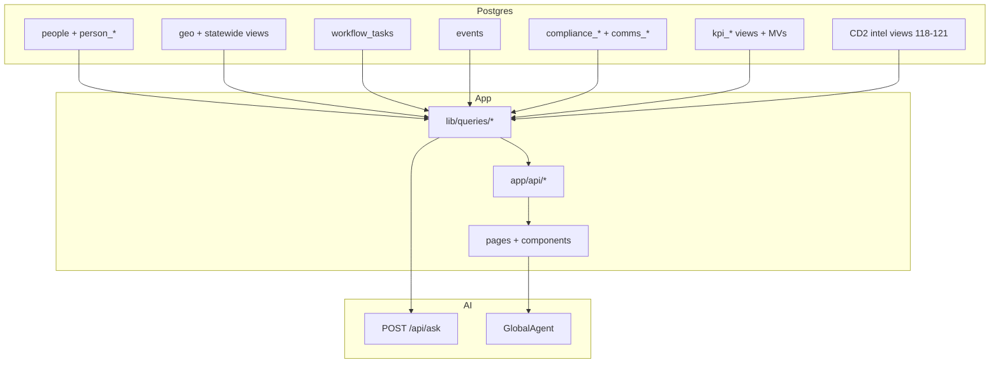

# Dependency matrix (tables → views → queries → APIs → pages → agents)

Wiring diagram for the **Campaign OS**: what depends on what, so modules stay interconnected rather than siloed.

**Companion doc**: [`master_system_map.md`](./master_system_map.md) (domains and north-star principles).

---

## Legend

| Tag | Meaning |
|-----|---------|
| **T** | Table (`public.*`) |
| **V** | View or materialized view |
| **Q** | TypeScript query module (`lib/queries/*`) |
| **API** | Route handler (`app/api/**/route.ts`) |
| **UI** | Page or component (`app/*`, `components/*`) |
| **AI** | Agent or approved report path |

---

## Cross-cutting flow (reference)

### Ask (`POST /api/ask`)

| Concern | Detail |
|---------|--------|
| Request | JSON body: `prompt` (required) and optional `context` (`AskClientContextPack`: `surface`, `pathname`, optional `personId`, `countyKey`, `cityKey`). |
| Enrichment | `lib/ask/parse-client-context.ts` validates input; `lib/ask/context-pack.ts` + `lib/queries/ask-context-snippets.ts` add DB-backed labels for routing and summarization. |
| Reports | `lib/ask/reports.ts` + `lib/types/intelligence.ts` — approved ids include CD2 (`cd2_*`), `campaign_kpi_snapshot`, `workflow_tasks_summary`, `messaging_journeys_summary`, and **`person_ask_snapshot`** (person 360: profile, compliance, tags, activity, journeys, linked tasks; requires a valid `context.personId`). |
| UI | `components/site/global-agent.tsx` builds the context pack from the current route; `components/reports/reports-agent-panel.tsx` sends it on each Ask. |

---

## People domain

| Layer | Artifact |
|-------|----------|
| T | `public.people`, `public.person_identifiers`, `public.person_contact_methods`, `public.person_addresses`, `public.person_source_links` |
| T | `public.person_activity`, `public.person_relationships`, `public.person_tags`, `public.tag_definitions` |
| T | `public.person_match_candidates`, `public.person_merge_log` |
| V | `public.people_master_v`, `public.people_match_review_v` |
| Q | `lib/queries/people.ts`, `lib/queries/compliance.ts` |
| API | `GET /api/people/search`, `GET /api/people/:personId`, `GET/PATCH /api/compliance/person/:personId` |
| UI | `/people/:personId` |
| AI | `GlobalAgent` on `/people/*`; `person_ask_snapshot` (Ask) when `context.personId` is set; compliance must inform any outreach suggestions |

---

## Compliance + comms (eligibility and operations)

| Layer | Artifact |
|-------|----------|
| T | `public.compliance_consent_events`, `public.compliance_suppressions`, `public.compliance_message_log`, `public.compliance_access_log` |
| T | `public.comms_templates`, `public.comms_queue`, `public.comms_webhook_events` |
| T | `public.messaging_objectives`, `public.messaging_audiences`, `public.messaging_journeys`, `public.messaging_journey_steps`, `public.messaging_journey_enrollments` |
| T | `public.person_communication_history`, `public.messaging_engagement_events`, `public.messaging_journey_compliance_logs`, `public.messaging_journey_metrics_daily`, `public.messaging_journey_step_metrics_daily` |
| T | `public.deliverability_threshold_configs` (`043`) — tunable bounce/complaint/opt-out/sender-health bands for workers and preflight |
| Q | `lib/queries/compliance.ts`, `lib/queries/comms.ts`, `lib/queries/messaging-orchestration.ts`, `lib/queries/messaging-engagement.ts`, `lib/queries/deliverability-thresholds.ts` |
| Svc | `lib/messaging/orchestrator.ts`, `branch-condition.ts`, `branch-processor.ts`, `journey-schedule.ts`, `engagement-ingestion.ts`, `adapters.ts`; `lib/server/secure-compare.ts` for Bearer secrets |
| API | `/api/compliance/person/:personId`, `/api/comms/*`, `/api/messaging/objectives`, `/api/messaging/audiences`, `/api/messaging/journeys`, `/api/messaging/journeys/:id/steps`, `/api/messaging/enrollments`, `GET /api/messaging/deliverability/thresholds`, `POST /api/messaging/orchestrator/tick` (Bearer `MESSAGING_ORCHESTRATOR_SECRET`) |
| UI | Person 360 banners; queue UIs as wired; journey builder UI TBD |
| AI | Agents must not suggest actions that violate `lib/queries/compliance` rules |

---

## KPI spine and campaign intelligence

| Layer | Artifact |
|-------|----------|
| V | `public.kpi_campaign_snapshot_v`, `public.kpi_county_snapshot_v` (`035`, extended `040`) |
| V | `public.kpi_campaign_intelligence_mv`, `public.kpi_county_intelligence_mv` (refresh: `public.refresh_kpi_intel()`) |
| Q | `lib/queries/kpi-intelligence.ts`, `lib/queries/dashboard.ts` (where used) |
| API | `GET /api/intelligence/kpi`, `POST /api/intelligence/kpi/refresh` (Bearer `KPI_REFRESH_SECRET`) |
| API | `GET /api/cm-hub/overview` (campaign snapshot + counties active + intel source) |
| API | `GET /api/dashboard/overview`, `GET /api/dashboard/status`, `GET /api/dashboard/counties`, `GET /api/dashboard/page` |
| UI | `app/cm-hub/page.tsx` (top counties, snapshot grid), dashboard |
| AI | Reports summarizing KPI payload; link `GET /api/intelligence/kpi` for operators |

---

## CD2 analytics / targeting intelligence (district model)

| Layer | Artifact |
|-------|----------|
| V | CD2 migrations `118`–`121` (precinct priority, targets, scorecard, intelligence layer) |
| Q | `lib/queries/intelligence.ts` |
| API | `GET /api/intelligence/cd2/summary`, `/county`, `/precincts`, `/segments/*`, `/voters/scorecard` |
| API | `GET /api/targeting/cd2/voters`, `/api/targeting/cd2/precincts` |
| UI | `components/dashboard/intelligence-command-panel.tsx`, voter segment panel, precinct table |
| AI | `POST /api/ask` → report IDs: CD2 (`cd2_*`), plus `campaign_kpi_snapshot`, `workflow_tasks_summary`, `messaging_journeys_summary`, `person_ask_snapshot` (`lib/types/intelligence.ts`, `lib/ask/reports.ts`) |

---

## County / precinct UI (consumer)

| Layer | Artifact |
|-------|----------|
| T | `public.geo_counties`, `public.geo_cities` |
| V | `public.statewide_county_master_v`, `public.statewide_precinct_priority_v`, `public.county_detail_export_v`, `public.statewide_city_master_v` |
| Q | `lib/queries/county-pages.ts` |
| API | `GET /api/counties/page`, `GET /api/counties/:countyKey/page` |
| UI | `/counties`, `/counties/:countyKey`, places, `create-workflow-task-button` on county |
| AI | `GlobalAgent` on `/counties/*` |

---

## Workflows domain

| Layer | Artifact |
|-------|----------|
| T | `public.workflow_tasks`, `public.workflow_task_dependencies` |
| Q | `lib/queries/cm-hub-workflows.ts` |
| API | `/api/cm-hub/workflows/board`, `/tasks`, `/tasks/:taskId`, `/dependencies`, `/lookups/*` |
| UI | `/cm-hub/workflows`, `create-workflow-task-button.tsx` |
| AI | `GlobalAgent` on `/cm-hub/*` |

---

## Events + command center

| Layer | Artifact |
|-------|----------|
| T | `public.events` |
| V | `public.events_rollup_v` |
| Q | `lib/queries/events.ts` |
| API | `GET /api/events/page`; `POST /api/command-center/events`, `submit`, `approve`, `ics` |
| UI | `calendar-panel`, `event-entry-panel`, `approval-queue-panel`, `/command-center/calendar` |
| AI | `GlobalAgent` on command-center routes |

---

## Field (mobile)

| Layer | Artifact |
|-------|----------|
| T | Turfs, canvass sessions/contacts/responses, followups (`sql/028_field_app_tables.sql`) |
| API | `/api/field/mobile/*` |
| UI | `app/field/mobile/*` |
| AI | **No** `GlobalAgent` on `/field/mobile/*` (thumb-first UX) |

---

## Volunteers

| Layer | Artifact |
|-------|----------|
| T | `public.volunteers`, roles, assignments, task completions (`027`) |
| Q | Volunteer dashboard queries |
| API | `/api/volunteers/*` |
| UI | `/volunteers/dashboard`, `/volunteers/list`, `/volunteers/:volunteerId` |

---

## Analytics (legacy naming)

| Layer | Artifact |
|-------|----------|
| API | `/api/analytics/overview`, `/counties`, `/precincts`, `/gaps` |
| Note | Overlaps conceptually with intelligence + dashboard; consolidate carefully when refactoring |

---

## System health

| Layer | Artifact |
|-------|----------|
| API | `GET /api/cm-hub/system-status` — registry of critical views (including `kpi_*` MVs) and API labels |
| API | `GET /api/geography/status`, `/api/census/status`, `/api/bls/status`, `/api/elections/status` |

---

## SQL migration order (source of truth)

See `scripts/run-sql-migrations.ts` — files run in listed order (e.g. `031`–`040` people, workflows, KPI, compliance, comms, KPI intel scale, then `118`+ CD2).

---

## Checklist when adding a feature

1. **People**: Does it attach to `public.people` or justify a new link table?
2. **County/precinct**: Does it read or write geography-scoped data?
3. **Workflows**: Should it create or close `workflow_tasks`?
4. **Reporting**: Does it belong in KPI spine, CD2 intel, or a new approved `/api/ask` report?
5. **Compliance**: Does outreach/export need consent/suppression checks?
6. **AI**: Which agent surface and which **typed** report or prompt path?
7. **Dashboards**: Which role hub (`/cm-hub` subtree) must surface it?

Update **this file** and **`master_system_map.md`** when the dependency chain changes.
