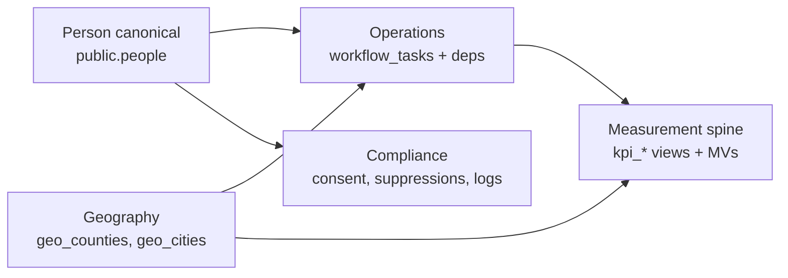

# Master system map (Campaign OS 2.0)

This document is the **north-star map** of the campaign operating system: operating domains, shared objects, and how modules connect. It stays aligned with the platform brief: **one people-centered system, one measurement spine, compliance-aware by default, AI as concierge—not decoration.**

For **tables → views → queries → APIs → UI → agents**, see [`dependency_matrix.md`](./dependency_matrix.md).

---

## North star (condensed)

| Principle | What it means in this repo |
|-----------|----------------------------|
| Simplicity on the surface | Role-shaped hubs under `/cm-hub`, mobile-first field, obvious next actions |
| Depth under the hood | Drilldowns (counties, precincts, Person 360), workflows, intelligence exports |
| No silos | Features link **people**, **geography**, **workflows**, **reporting**, **compliance** |
| Compliance by default | Consent/suppressions/logs in Postgres; UI and agents respect eligibility |
| Measurable | KPI views/MVs + CD2 analytics; refresh hooks for scale |
| AI-native | Global agent + Reports Agent + **context-grounded** `/api/ask` (see below) |
| Unified messaging | One orchestration plane: objectives → journeys → steps → enrollments → queue → send → memory → metrics; compliance in the loop |

---

## Core shared objects (the “no silos” backbone)

- **Person (canonical)**: `public.people` (+ identifiers, contacts, addresses, source links, tags, relationships, activity, merge/match).
- **Geography**: `public.geo_counties`, `public.geo_cities` (+ statewide master / export / CD2 layers).
- **Workflow tasks**: `public.workflow_tasks`, `public.workflow_task_dependencies` (links include `person_id`, `county_id`, `event_id`, etc.).
- **Events**: `public.events` (+ `public.events_rollup_v`).
- **KPI spine**: `public.kpi_campaign_snapshot_v`, `public.kpi_county_snapshot_v`; scale layer: `public.kpi_campaign_intelligence_mv`, `public.kpi_county_intelligence_mv` (`refresh_kpi_intel()`).
- **Compliance**: `public.compliance_consent_events`, `public.compliance_suppressions`, `public.compliance_message_log`, `public.compliance_access_log`.
- **Messaging orchestration** (journeys, not blasts): `public.messaging_objectives`, `public.messaging_audiences`, `public.messaging_journeys`, `public.messaging_journey_steps`, `public.messaging_journey_enrollments`, `public.person_communication_history`, `public.messaging_journey_compliance_logs`, daily metrics (`sql/041_messaging_orchestration.sql`); engagement + branching (`sql/042_messaging_engagement_branching.sql`). Execution: `lib/messaging/orchestrator.ts` and related modules; tick: `POST /api/messaging/orchestrator/tick`.

---

## Operating domains (inventory)

Statuses: **live** | **in build** | **planned** (see running table below).

### A. Executive / strategy (CM Hub, KPIs, reporting)

- **Surfaces**: `app/cm-hub/*`, `components/reports/reports-agent-panel.tsx`, `components/site/global-agent.tsx`, `app/dashboard/page.tsx`.
- **Data**: workflow + volunteer + event rollups; KPI snapshot views/MVs; optional CD2 intelligence summaries.
- **APIs**: `GET /api/cm-hub/overview`, `GET /api/intelligence/kpi`, `POST /api/intelligence/kpi/refresh` (Bearer `KPI_REFRESH_SECRET`), `GET /api/dashboard/*`, analytics under `/api/analytics/*`.
- **Health**: `GET /api/cm-hub/system-status` (includes KPI view/MV checks).

### B. People domain

- **Tables**: `public.people`, `public.person_*`, `public.tag_definitions`, `public.person_merge_log`, `public.person_match_candidates`, …
- **Views**: `public.people_master_v`, `public.people_match_review_v`.
- **UI/API**: Person 360 `app/people/[personId]/page.tsx`; `GET /api/people/search`, `GET /api/people/:personId`.

### C. County / precinct intelligence

- **Statewide / export**: `public.statewide_county_master_v`, `public.statewide_precinct_priority_v`, `public.county_detail_export_v`, `public.statewide_city_master_v`.
- **CD2 analytics layer** (migrations `118`–`121`): precinct priority, targets, intelligence summaries—consumed by `lib/queries/intelligence.ts` and `/api/intelligence/cd2/*`.
- **UI**: `app/counties/*`, dashboard panels, county workflow actions.

### D. Workflow domain (campaign operations)

- **APIs**: `/api/cm-hub/workflows/board`, `/tasks`, `/dependencies`, lookups (`counties`, `volunteers`, `turfs`, `people`).
- **UI**: `app/cm-hub/workflows/workflows-client.tsx`, `components/cm-hub/create-workflow-task-button.tsx`.

### E. Field domain

- **Tables**: turfs, canvass sessions/contacts/responses, followups, sync/DQ flags (`sql/028_field_app_tables.sql`).
- **UI**: `app/field/mobile/*`.

### F. Volunteer domain

- **Tables**: `public.volunteers`, roles, assignments, task completions (`sql/027_volunteer_os_tables.sql`).
- **UI/API**: `/volunteers/*`, `/api/volunteers/*`.

### G. Communications & messaging (unified orchestration)

**Mental model**: separate channel tools (email, SMS, social, phone) are **not** the product—**journeys and sequences** coordinated against people, geography, and KPIs are. The orchestrator resolves audiences, advances enrollments, respects compliance, writes **message memory** (`person_communication_history`), and hands off sends to the existing comms pipeline.

**Channel + delivery foundation**

- **Tables**: `public.comms_templates`, `public.comms_queue`, `public.comms_webhook_events` (`sql/037_comms_core.sql`); compliance message log (`036`/`038`/`039`).
- **APIs**: `/api/comms/*`, webhooks SendGrid/Twilio; adapters in `lib/messaging/adapters.ts`.

**Journey orchestration (in repo)**

- **Schema**: `041` / `042` — objectives, audiences, journeys, steps (`send` | `wait` | `condition` | `branch`), enrollments (`active` | `waiting_branch` | …), compliance logs, journey/step daily metrics, `messaging_engagement_events` for webhook-driven branching.
- **Services**: `lib/messaging/orchestrator.ts`, `branch-processor.ts`, `branch-condition.ts`, `journey-schedule.ts`, `engagement-ingestion.ts`.
- **APIs**: `/api/messaging/objectives`, `/audiences`, `/journeys`, `/journeys/:id/steps`, `/enrollments`, `GET /api/messaging/deliverability/thresholds`, `POST /api/messaging/orchestrator/tick` (Bearer `MESSAGING_ORCHESTRATOR_SECRET`).

**Deliverability intelligence (immune system — in progress)**

**Shipped (v0):** `public.deliverability_threshold_configs` (`043`) with seeded warning/critical bands; `lib/queries/deliverability-thresholds.ts`; `GET /api/messaging/deliverability/thresholds`; Bearer comparison for cron-style routes uses `lib/server/secure-compare.ts` (timing-safe).

**Still planned:** full layer **between** orchestration and providers—**sender** health (reputation, capacity, warming), **audience** risk, **preflight** (overlap, fatigue, content signals), **adaptive pacing** (waves, auto-throttle), **content lint**, **per-person channel fatigue**, **incidents** (spike detection, auto-pause). Target pipeline:

`Journey step → audience → compliance → (deliverability) → queue build → wave schedule → adapters → webhooks → metrics → sender/audience/fatigue updates → reporting + AI recommendations`

**Next strategic slice** after deliverability hardening: explicit **journey lifecycle** contracts (templates for recurring programs) so orchestration stays operable at campaign scale.

### H. Events domain

- **Tables/views**: `public.events`, `public.events_rollup_v`.
- **Surfaces**: command center calendar and approvals; `components/dashboard/calendar-panel.tsx`, `EventCard`.

### I. Compliance domain

- **Enforcement**: channel-aware consent + suppressions; outbound and access logging.
- **API**: `GET/PATCH /api/compliance/person/:personId` (read/update consent and suppressions for Person 360).
- **KPI tie-in**: campaign snapshot can include outbound volume from `compliance_message_log` (see `040_kpi_intel_scale.sql`).

### J–L. Collaboration, fundraising, public site, Discord (outer layer)

- **Planned** per build brief: chat, GoodChange, Mobilize, site builder, Discord agents—no persistent map here until schemas land; extend this doc when migrations ship.

---

## Agents and AI surfaces

| Surface | Role |
|--------|------|
| `components/site/global-agent.tsx` | Route-aware concierge; hidden on `/field/mobile/*`; builds `AskClientContextPack` from pathname/params |
| `components/reports/reports-agent-panel.tsx` | Reports Agent UI; sends `{ prompt, context? }` to Ask |
| `POST /api/ask` | Body: `prompt` + optional **`context`** (`AskClientContextPack`: `surface`, `pathname`, optional `personId`, `countyKey`, `cityKey`). Server validates (`lib/ask/parse-client-context.ts`), enriches from DB (`lib/ask/context-pack.ts`, `lib/queries/ask-context-snippets.ts`), routes to an **approved** report id, returns summary + `contextSummaryLine` / `contextHints`. Reports: CD2 (`cd2_*`), `campaign_kpi_snapshot`, `workflow_tasks_summary`, `messaging_journeys_summary`, **`person_ask_snapshot`** (requires valid `context.personId`). See `lib/ask/reports.ts`, `AskReportId` in `lib/types/intelligence.ts`. |
| Messaging / deliverability (future) | AI as **orchestration strategist** (journey design, audience suggestions, pacing/risk narration)—ground on journey metrics + (once built) deliverability and fatigue contracts |

**Rule**: New AI features should register report capabilities in typed contracts and avoid suggesting non-compliant actions (see compliance queries and task guards). **Ask** must not treat client-supplied labels as authoritative—only server-enriched fields and report JSON.

---

## Running status (maintain per workstream)

Use: **planned → in design → in build → blocked → validating → live → needs refinement**.

| Workstream | Status | Notes |
|------------|--------|-------|
| People system (core + 360) | live | Match review UI can deepen |
| Identity resolution | validating | Merge log + candidate queue |
| Workflows (tasks + deps + person link) | live | Board/list/timeline expansion |
| County / statewide intelligence | live | CD2 + KPI county MV |
| KPI spine + intel MVs | live | Schedule `refresh_kpi_intel()` under load |
| Compliance core + Person 360 | live | Global enforcement in comms send path still deepening |
| Comms queue + webhooks | in build | Production blast + approvals |
| Messaging orchestration (journeys, orchestrator, engagement) | in build | Deepen UI + non-email/sms channels; wave logic |
| Deliverability intelligence | in build | Threshold configs (`043`) + read API; sender/preflight/pacing/incidents still planned |
| Reports Agent (NL + context packs + person snapshot) | in build | `/api/ask` + `person_ask_snapshot` on Person 360 |
| Events calendar + approvals | live | Admin gating local-only |
| Field mobile | in build | Offline + phonebank |
| Volunteer OS | in build | Lifecycle + Power of 5 |
| Fundraising / GoodChange | planned | |
| Chat / Discord | planned | |
| Public site builder | planned | |

---

## How to extend this map

When a new vertical ships, update:

1. This file (domain paragraph + status).
2. [`dependency_matrix.md`](./dependency_matrix.md) (layers + agents).
3. `app/api/cm-hub/system-status/route.ts` if new critical views/APIs should appear in health checks.
